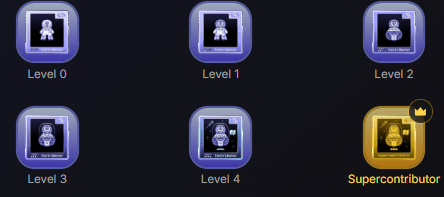

Amit — Frontend Developer Portfolio
I build clean, accessible, and responsive web interfaces. I focus on semantic HTML, modern CSS,and pragmatic JavaScript
while learning backend fundamentals with Node.js. This repo collects projects, notes, and demos that showcase my skills and growth.

Web Technologies
- HTML — 85%
█████████████████▌ 85%
- CSS — 80%
████████████████ 80%
- Node.js — 50% Learning
██████████---------- 50%

Core Competencies
- Problem Solving — 80%
████████████████ 80%
- Open Source — 70%
██████████████ 70%
- Team Collaboration — 75%
███████████████ 75%

About Me
I enjoy turning design ideas into accessible, performant web pages. I write semantic markup, craft responsive layouts with CSS, and use JavaScript to add meaningful interactivity.
I contribute to open source when possible and follow collaborative Git workflows to keep code clean and reviewable.

